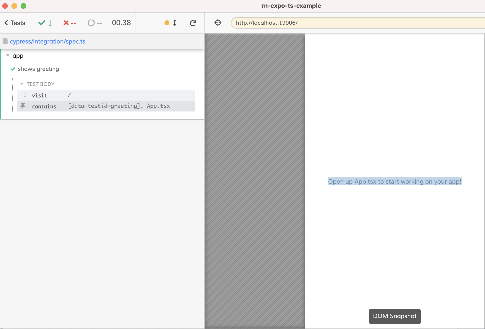

# Expo RN TypeScript Example

With Cypress TypeScript specs

```
$ yarn install
$ yarn web # starts the app
$ yarn cy:open # runs Cypress
```



## Read

- [The Complete Guide to Testing React Native App Using Cypress](https://glebbahmutov.com/blog/testing-react-native-app-using-cypress/)
- [Testing React Native Todo Application Using Cypress](https://glebbahmutov.com/blog/testing-rn-todo-app/)
